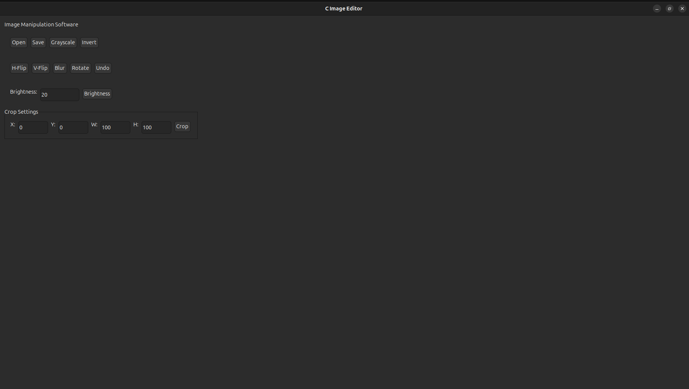
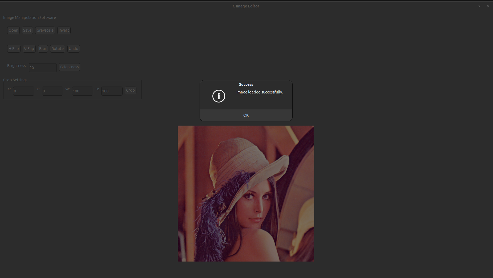
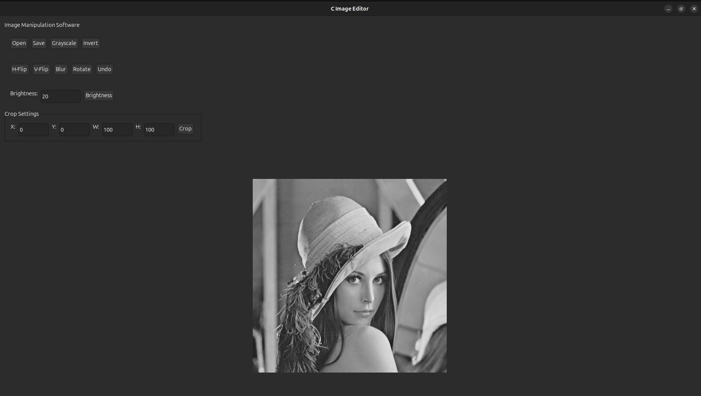
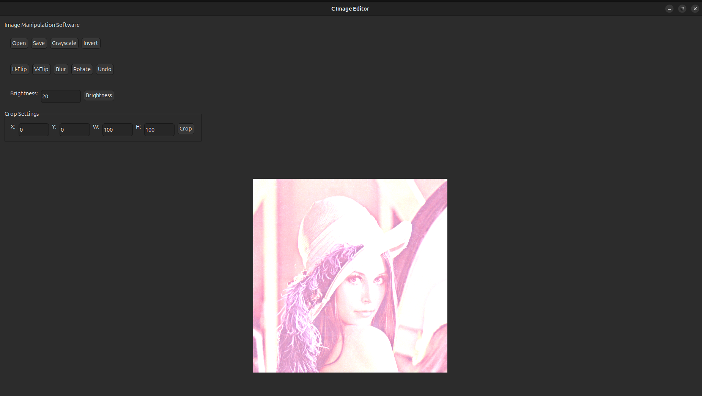
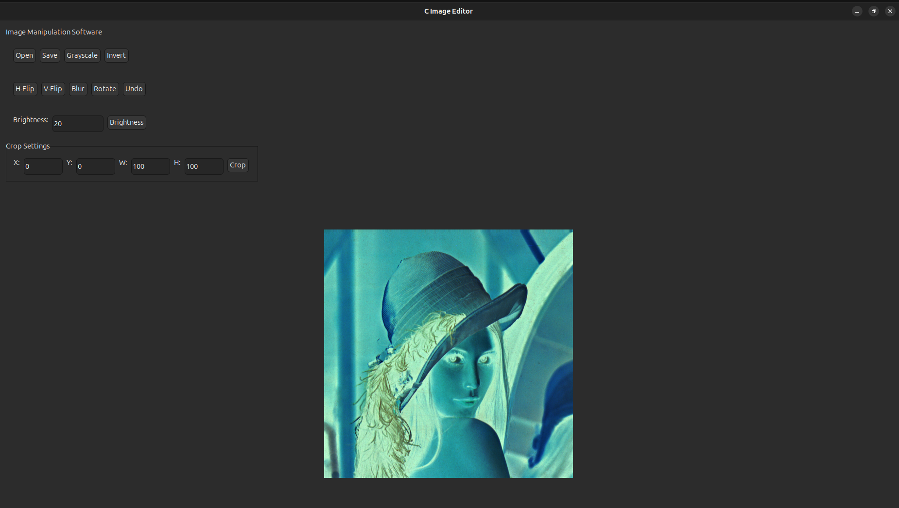
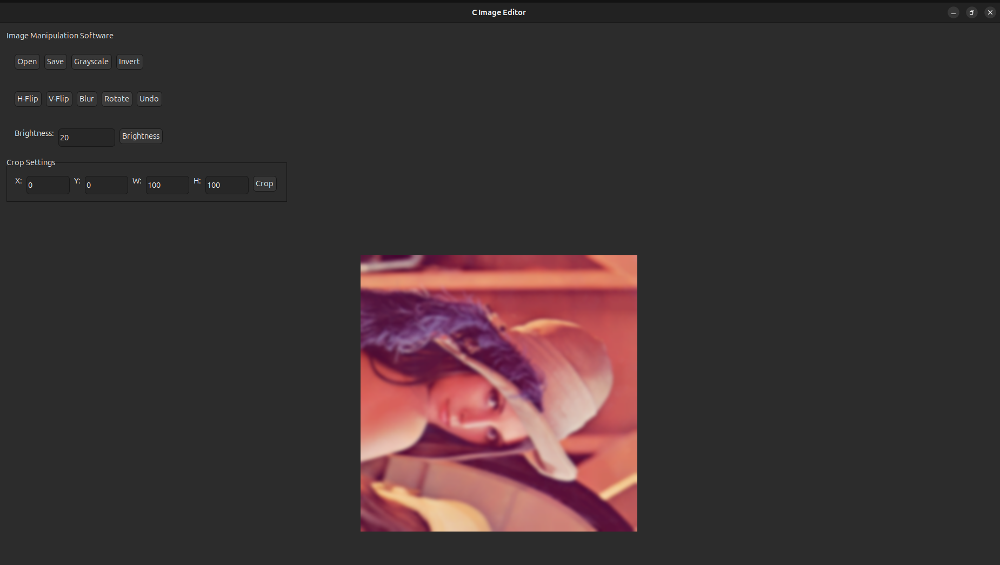
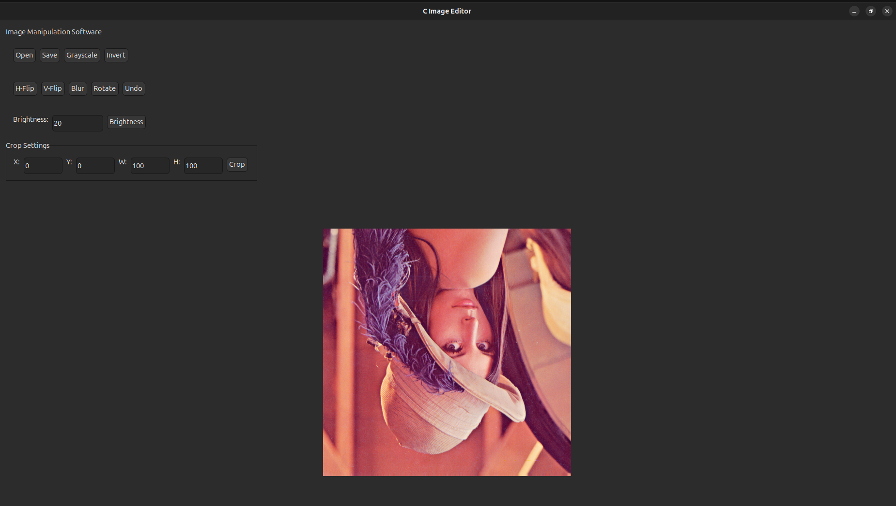
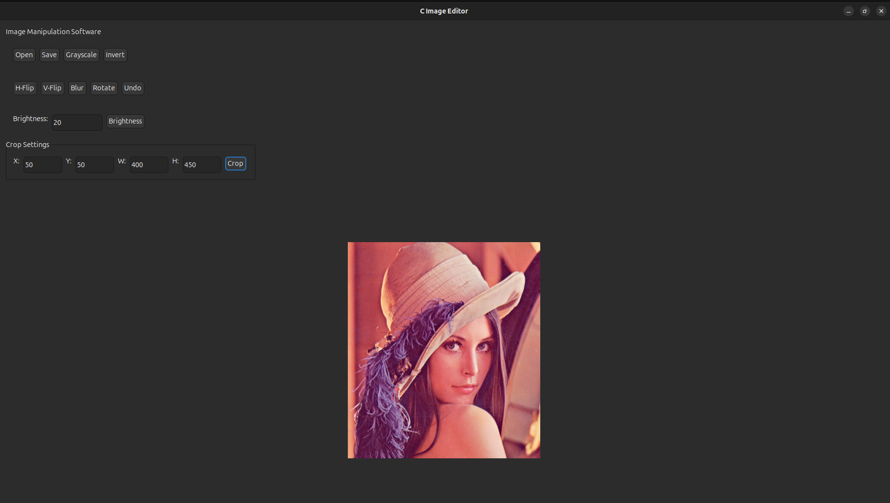
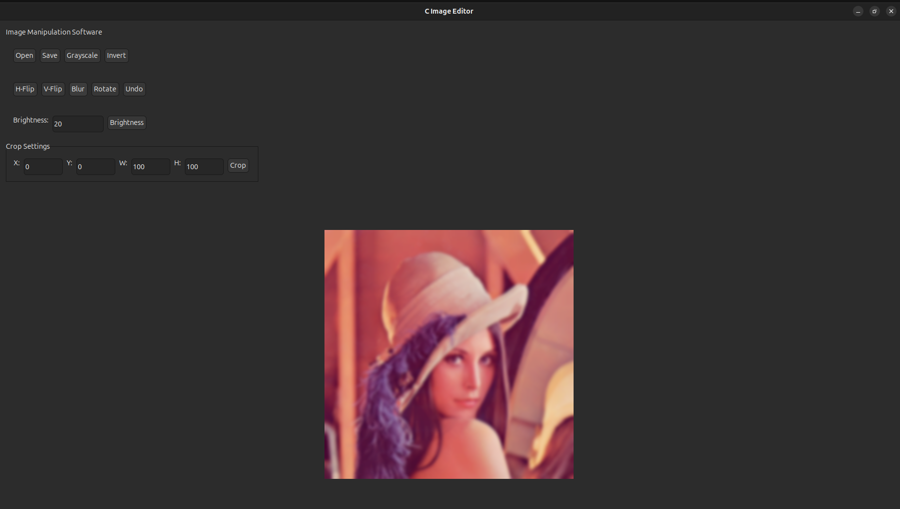
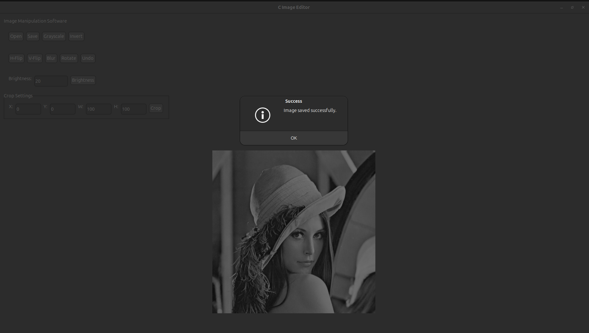

# Image_Editor_Software
BMP 24 bit image editor with basic editing tools.


To run this project IUP library must be installed and linked separately.


## Features

- **Open** – Load a BMP image from disk
- **Save** – Save the edited image back to disk
- **Grayscale** – Convert the image to grayscale
- **Brightness Adjustment** – Increase or decrease image brightness
- **Invert** – Invert the colors of the image
- **Flip** – Flip the image horizontally or vertically
- **Rotate** – Rotate the image by 90 degrees
- **Crop** – Crop a selected region of the image
- **Blur** – Apply a blur effect to the image
- **Undo** - undo anything to the previous

## Technology Used

- **Language:** C
- **GUI Toolkit:** IUP
- **Image I/O:** stb_image.h and stb_image_write.h are used only for reading and writing the BMP file format. All image manipulation algorithms are implemented from scratch.

## How to Run

1. Download and install the IUP toolkit
2. Compile the source files, linking against the IUP library:


 ```gcc main.c bmp.c image.c processing.c -o image_editor -liup -liupcontrols  ```
 3. Use the GUI to open `lena.bmp` (included in this repository) or any other 24-bit BMP image.

## Screenshots

### Main Window


### Open Image


### Grayscale


### Brightness Adjustment


### Invert


### Horizontal Flip and Rotate


### Vertical Flip


### Crop


### Blur


### Save

